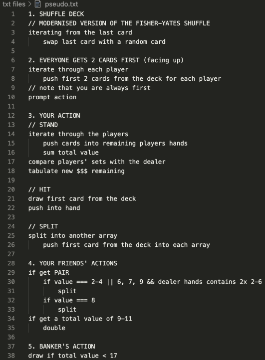
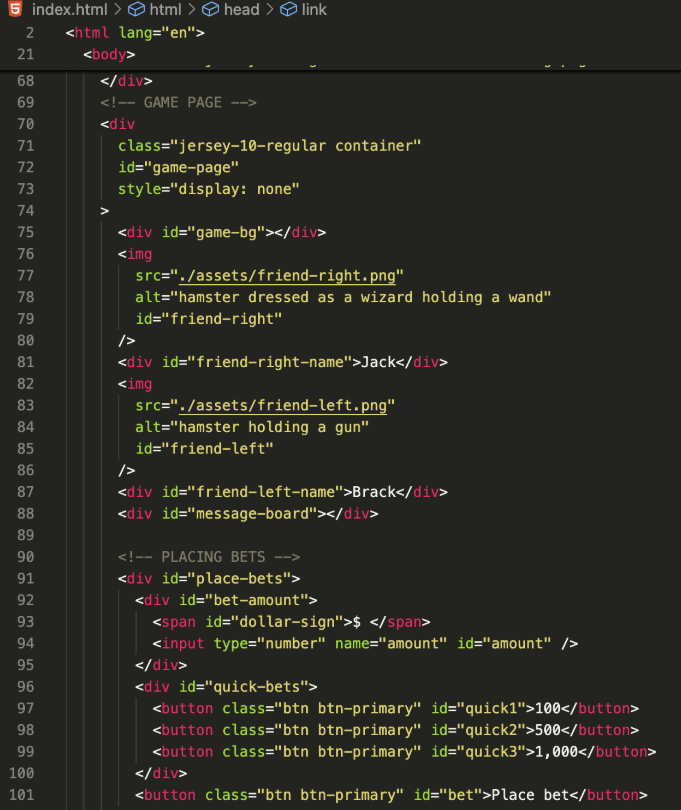
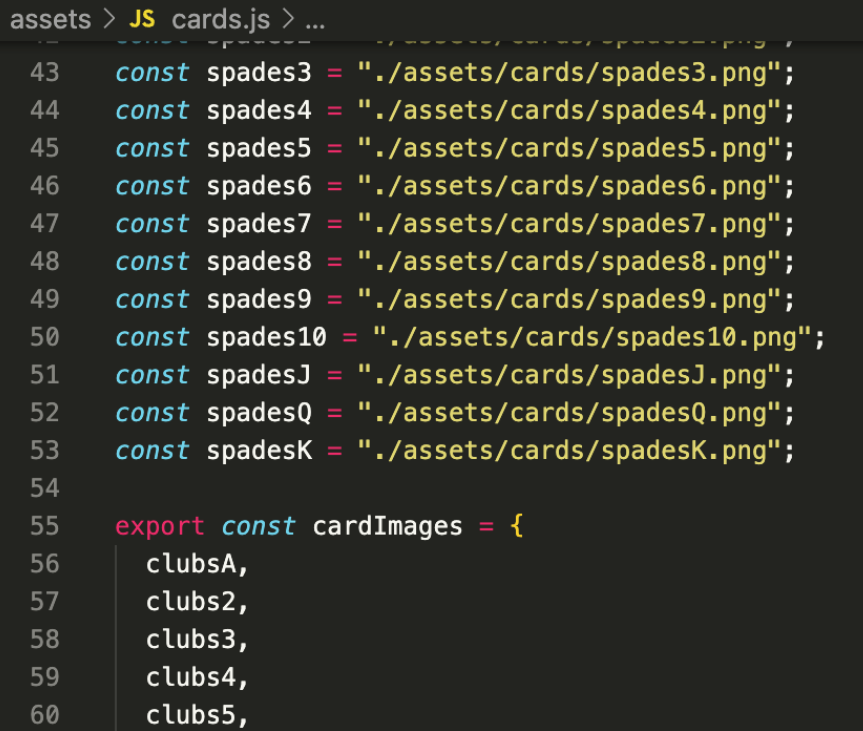
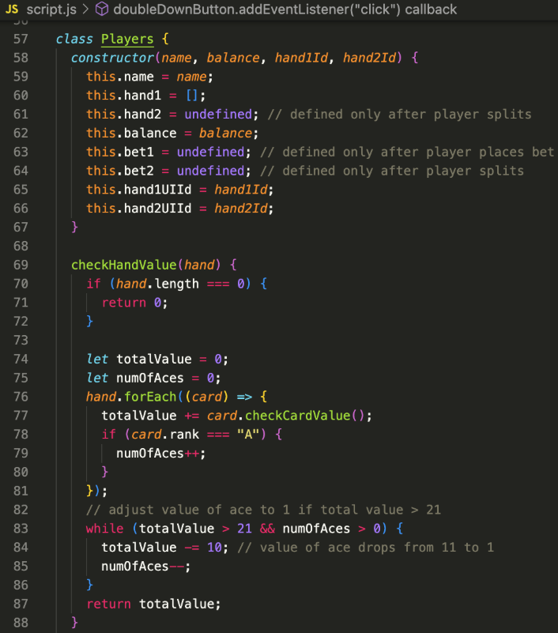
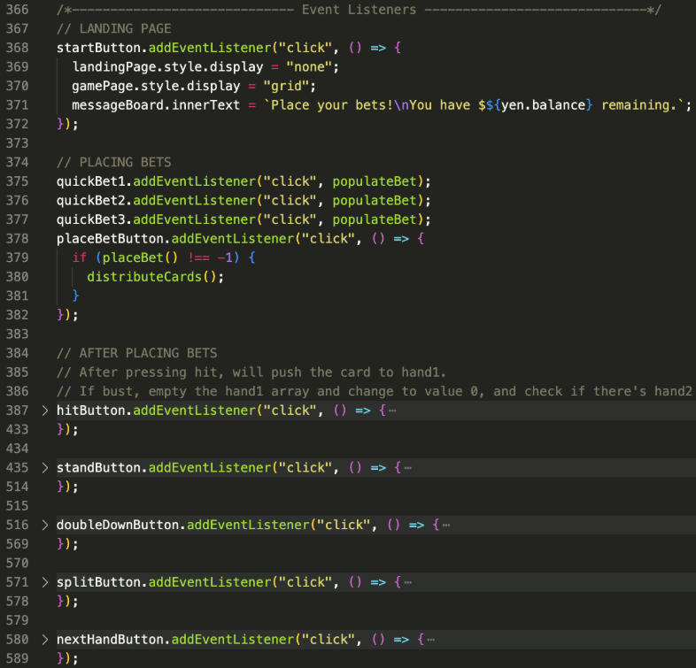

# Blackjack
---

---
## Table of Contents
- [About The Game](https://github.com/chickenONsteak/project-1-blackjack?tab=readme-ov-file#about-the-game)
- [Tech Stack](https://github.com/chickenONsteak/project-1-blackjack?tab=readme-ov-file#tech-stack)
- [Getting Started](https://github.com/chickenONsteak/project-1-blackjack?tab=readme-ov-file#getting-started)
- [Folder Structure](https://github.com/chickenONsteak/project-1-blackjack?tab=readme-ov-file#folder-structure)
- [Usage](https://github.com/chickenONsteak/project-1-blackjack?tab=readme-ov-file#usage)
- [Planning Process](https://github.com/chickenONsteak/project-1-blackjack?tab=readme-ov-file#planning-process)
---
## About The Game
You and your friends, Brack and Jack, thought that it would be a good idea to try your luck at the casino to make big bucks. Going in with $1000, you anticipate the luxurious celebratory meal you and your friends will be having after the session.

Gameplay: This game replicates the core mechanics of a casino-style Blackjack game, namely betting, hitting, standing, doubling down, and splitting.

Main goal for MVP:
- Card distribution logic for player and dealer
- Display cards
- Create win condition where the player has a higher hand value than the dealer and player's hand value is <22
- Create lose condition where the player has a hand of lower value and dealer's hand value is <22 OR does not have enough money remaining

Stretch goal:
- Allow players to double their bets
- Allow players to split their hands

This game was created after picking up the basics of HTML, CSS, Bootstrap, and JavaScript to put them into practice. The goal was to keep features simple so that I am able to spend more time exploring OOP (Object Oriented Program) and following good practices.
---
## Tech Stack
- **HTML5** — structure of the game UI
- **CSS** — base styling
- **Bootstrap** — components *(buttons and input field)*
- **Javascript** *(Vanilla)* — game logic and DOM manipulation
---
## Getting Started
To hop onto the game, simply try it on the [live demo](https://chickenonsteak.github.io/project-1-blackjack/) site.
---
## Folder Structure
- assets/
    - cards/
    - card.js
    - friend-left.png
    - friend-right.png
    - landingpageimg.avif
    - table-bg-jpb
- index.html
- style.css
- script.js
---
## Usage
- Press "Enter casino" to start the game
- Press "Place bet" a bet that is less than your remaining balance but more than $100
- Press "Hit" to draw another card
- Press "Stand" to end your turn
- Press "Double down" to double your bet and draw a card *(if you have sufficient balance)*
- Press "Split" if you have a pair of cards with the same value to split your hand
---
## Planning process
With a short timeframe to complete the project AND experimenting with a new approach, planning was crucial.
### 1. Planning the structure and layout of the game
> Before doing anything, I listed down what I envisioned the game to look like and listed down the components that users will see and behaviours they will encounter.

### 2. Attempt at Pseudocode
> I tried listing down the pseudocodes for the game's logic, but since Pseudocode is a new concept to me, I was unable to extract a lot of value from this exercise.

### 3. Structuring the HTML & Bootstrap + Styling with CSS
> After planning out what users will see and behaviours they will experience, I got started coding out the front-end first.

### 4. Preparing the assets
> All images, regardless of what they are, are stored into the ./assets directory.

### 5. Creating Classes & methods
> Since I was planning to use OOP to code out this game, there were a lot of planning ahead items involved so that the methods are reusable and clean.

### 6. Add event listeners
> The game waits for users to press an action button in order to carry out an action. Hence, there is a need for event listeners — which also improves readability throughout the codes.

